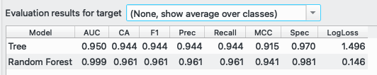
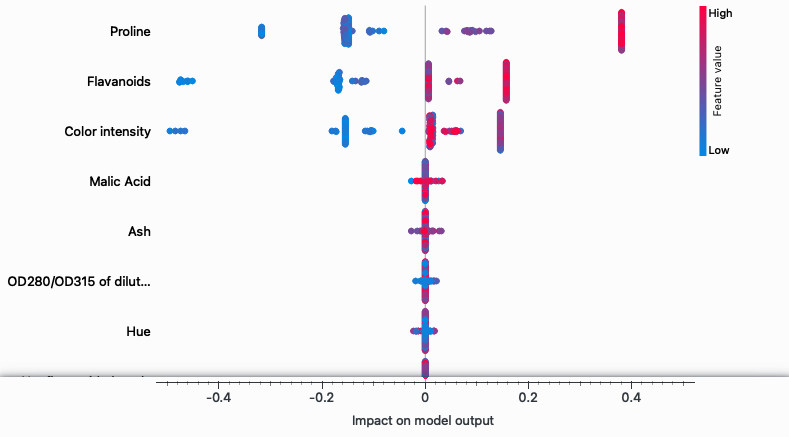

## Kurs: Uczenie Maszynowe 2
***Autor: Marcin Wardyński, Grupa: Wtorek, 9:45***

## Laboratorium 1: Interpretowalnoś modeli ML - metoda Shapleya

### Użyte dane

Do przeprowadzenia ćwiczenia wykorzystałem zbiór UCI https://archive.ics.uci.edu/dataset/109/wine, który to jest dostępny bezpośrednio na platformie Orange.

Zawiera on opis 178 próbek win z trzech różnych gatunków winorośli - gatunek winorośli odpowiada za klasę nadaną danej próbce ze zbioru {1, 2, 3}. Poza klasą, każda próbka wina scharakteryzowana jest trzynastoma cechami o wartościach liczbowych, zmienno- i stałoprzecinkowych

### Polecenia do zadania

#### 1. Zwróć uwagę by zbiór zawierał ciekawe i zróżnicowane przykłady. Wykorzystaj do wybierania przykładów ciekawych widget ICE oraz Explain Predictions

Zarówno widget *ICE*, jak i *Expain Predictions* przekonują co do zróżnicowania próbek w użytym zbiorze danych. Ponieważ potrzebujemy dwóch ciekawych próbek, wybiorę jedną z nich za pomocą *Explain Predictions* i drugą używając widgetu *ICE* dla zastosowanego modelu klasyfikującego lasu losowego.

- *Explain Predictons*

Diagram ten pokazuje dla wybranych próbek z jaką wagą poszczególne cechy przyczyniają się do wybranej klasyfikacji. W załączonym zrzucie ekranu wybraną kategorią, jest klasa winorośli = 1. Można dostrzec kilka ciekawych próbek do przebadania, jak np.: te dwie-trzy próbki należące do klasy 1, ale posiadające niższą sumę punktów od pozostałych, czy też kilka próbek spoza klasy 1, ale posiadających kilka cech, które kwalifikowałyby tą próbkę do klasy 1 całkiem dobrze.

Dla celów tego laboratorium zdecydowałem się uwzględnić próbkę zaznaczoną na żółty, czyli spoza klasy 1, ale posiadającej kilka cech dobrze kwalifikujących się do klasy 1.

- *ICE*

*ICE* przedstawia wpływ pojedyńczej cechy na efekt klasyfikacji modelu. Ponieważ każdy wykres widgetu przestawia wszystkie próbki w kontekście pojedyńczej cechy, musimy zdecydować się na wybór jednej z nich. Dla ułatwienia doboru posortowałem cechy od najważniejszej dla wybranej klasy (więcej na temat istotności cech w kolejnych punktach sprawozdania).

Dla zaznaczonej klasy 2, najważniejszą cechą jest "Intensywność koloru" i wśród wszystkich próbek zainteresowała mnie ta należąca do klasy 2, która charakteryzuje się niską zmianą prawdopodobieństwa ΔP(Wine=2) dla tej klasy. Na załączonym zrzucie ekranu próbka ta jest zaznaczona kolorem czarnym.

#### 2. Jako modele wybierz drzewa decyzyjne i lasy losowe. Zwróć uwagę na to by silniejszy model dawał lepszą dokładność dla danych testowych. Pokaż jak wpływa wybór lasów losowych (boosting i random subsets) na zmianę rankingu cech Shapleya.

Dla przekazanych wszystkich cech, las losowy daje lepsze wyniki:

Aby sprawdzić boosting, muszę dodać nowy widget, a mianowicie *Gradient Boosting*, ponieważ *Random Forest* bazuje na koncepcie baggingu, a nie boostingu i nie można tego zmienić. Po dodaniu nowego modelu, wyniki prezentują się następująco:

Widzimy, że *Gradient Boosting*, ustępuje niewiele *Random Forest*, jednak jest wyraźnie lepszy od pojedyńczego drzewa decyzyjnego *Tree*.

Poza tym, domyśla implementacja *Random Forest* w *Orange* losuje zbiór attrybutów dla każdego drzewa w lesie na nowo, i tego zachowania nie można zmienić za pomocą żadnego parametru.

Zmiany w rankingu cech Shapleya zostaną przebadane w kolejnym punkcie, więc tu tylko sprawdzę, posortowane zestawy cech wewnątrz widgetu *ICE* dla modelu *Random Forest* oraz *Gradient Boosting*.

- *Random Forest*  

- *Gradient Boosting*  

Jak widzimy powyżej, istnieją drobne rozbieżności w doborze najważniejszych cech w zależności od wybranej klasy winogron pomiędzy tymi modelami, jednakże nie wolno zapominać o losowym charakterze *Random Forest*, gdzie pomiędzy dwoma różnymi instancjami tego rodzaju modelu mogą zajść rozbieżności w doborze istotnych cech.

#### 3. Dokonaj analizy wyników przy pomocy: Feature importance, Explain model.

##### Feature Importance

*Feature Importance* pokazuje ważność poszczególnych cech w stosunku do wybranej metody oceny skuteczności klasyfikacji modelu. W przeciwieństwie do *Explain Model*, nie są tu istotne cechy przypisujące daną próbkę do wybranej klasy, lecz cechy które generalnie mają największy wpływ skuteczność działania modelu.

Jako metrykę skuteczności można wybrać wiele wartości, jak AUC/F1/Precision/Recall i w zależności od tego wyboru, ulegają zmianie wagi istotności cech dla modelu, co może skutkować w różnej kolejności najważniejszych cech dla różnych kryteriów oceny. W dalszej części tego podpunktu skupimy się wyłącznie na ocenie Area Under the Curve (AUC).

- *Random Forest*  

- *Gradient Boosting*  

- *Tree*  

Dla wszystkich trzech modeli zestaw najważniejszych cech jest taki sam, a mianowicie: "Flavanoids", "Color intensity" oraz "Proline", jednakże różnice w budowie i zasadzie działania każdego z modeli uwidacznia się różną wagą istotności tych cech dla każdego z nich.

*Random Forest* bazuje poprawność swojej klasyfikacji głównie na cesze "Flavanoids", a pozostałe dwie są właściwie trzykrontnie mniej istotne. W przypadku klasyfikacji przez *Tree*, "Flavanoids" jest wciąż najważniejszą cechą, lecz "Color intensity" prawie się z nią zrównuje, natomiast dla widgetu *Gradient Boosting* to "Color intensity" staje się najskuteczniejszym dyskriminatorem podanego zbioru danych, a "Flavanoids" wraz z "Proline" są wciąż bardzo skuteczne, lecz ustępują "Color intensity".

##### Explain Model

Używając tego widgetu uzyskujemy wytłumaczenie, jakie wartości dla konkretnych cech powodowały przypisanie próbki do wybranej klasy, i jak duży wpływ miały one na wybór klasy docelowej.

Przyjżyjmy się w pierwszej kolejności wyłumaczeniu dzaiałnia modelu *Random Forest*, na podstawie którego opiszę wyniki pracy widgetu.

- *Random Forest*  
    - Klasa: 1  
    
    - Klasa: 2  
    
    - Klasa: 3  
    

Generalnie czym dana kropka jest dalej odsunięta od osi środkowej, tym większy ma wpływ na przypisanie do danej klasy. Jeśli jest daleko po stronie lewej, to ten wpływ jest negatywny, po stronie prawej, pozytywny. Kolor kropek oznacza towarzyszące im wartości, barwa ciepła to duża wartość, a zimna, mała.

Przeanalizujmy trzy cechy, które wyróżniliśmy jako najistotniejsze dla oceny AUC w poprzednim podpunkcie, czyli:  "Flavanoids", "Color intensity" oraz "Proline".

Dla klasy 1 faktycznie mają one punkty najdalej rozrzucone od osi środkowej, tak samo dla klasy 2, co udowadnia słuszność obserwacji poczynionej w widgecie *Feature Importance*. Natomiast dla klasy 3 "Proline" ma niewielki wpływ na przypisanie tej klasy, a "Color intensity" ma ten wpływ tylko niewiele większy, lecz istotność tych cech dla klas 1 i 2 wystarcza, aby były one generalnie ważne dla modelu.

Spójrzmy jeszcze na wartości cechy "Color intensity" dla klasy 1. Okazuje się, że małe wartości dla tej cechy wpływają negatywnie na wybór klasy 1, duże wartości trochę pozytywnie, natomiast największą wagę wnoszą wartości ze środka przedziału tej cechy. Widzimy również, że próbek o umiarkowanej i dużej wielkości wartości, które wnoszą podobny wkład do jakości klasyfikacji modelu jest całkiem sporo, stąd są widoczne ich skupiska na diagramie.

Ciekawym przypadkiem wartym odnotowania, jest duże skupisko próbek o dużej wartości cechy "Proline", które to negatywnie wpływają na przypisanie ich do klasy 2.

Wszystkie cechy dla dowolnego wybranego modelu można analizować dokładnie w taki sam sposób, jak te powyżej.

- *Gradient Boosting*  
    - Klasa: 1  
    
    - Klasa: 2  
    
    - Klasa: 3  
    

- *Tree*  
    - Klasa: 1  
    
    - Klasa: 2  
    
    - Klasa: 3  
    

Zarówno dla *Gradient Boosting*, jak i *Tree* rozrzut wartości od osi środkowej dla cech "Flavanoids", "Color intensity" oraz "Proline" potwierdzają słuszność wcześniejszych obserwacji na temat ważności tych cech dla modelu. 

Analizę wielkości wartości adekwatnej do wybranej klasy można przeprowadzić w sposób analogiczny do zapisanego powyżej, więc nie będę jej przeprowadzał dla każdego diagramu z osobna.

Ciekawą obserwację można poczynić przyglądając się rozkładowi próbek przy klasyfikacji modelem drzewa decyzyjnego. W przeciwieństwie do pozosatałych dwóch modeli opartych na lesie losowym, próbki w tym przypadku występują w dużej mierze w skupiskach, a nie rozproszone po całej osi X. Wynika to z charakteru modelu *Tree*, który to poprzez swoją skokową strukturę podziału próbek - kolejny podział co poziom jednego drzewa - prowadzi do powstania skupisk jak na diagramie.

#### 4. Wytłumacz (Explain prediction) dla obu modeli dlaczego wybrane (2) przykłady testowe zostały zaklasyfikowane do danych klas. Porównaj wynik działania dla różnych modeli. Przedyskutuj krótko otrzymany wynik.

##### Przykład pierwszy

Zacznijmy od przypadku pierwszego, który to wybrałem za pomocą widgetu *Explain predictions*. Przypomnę, że jest to próbka z klasy 2, która przez model *Random Foreset* została również wysoko oceniona dla klasy 1.

- *Random Forest*, Klasa: 1  

- *Random Forest*, Klasa: 2  

- *Random Forest*, Klasa: 3  

Faktycznie możemy zobaczyć, że ocena tej próbki w kontekście klasy 1 jest dość wysoka, a dodatkowo tak ważne cechy, jak "Color Intensity" oraz "Flavanoids" przemawiają za wyborem klasy 1. Jednakże klasa 2 otrzymuje jeszcze wyższe noty, a to głównie za sprawą trzeciej istotnej cechy, czyli "Proline", która to była silnie negatywna przy wyborze klasy 1.

- *Tree*, Klasa: 1  

- *Tree*, Klasa: 2  

- *Tree*, Klasa: 3  

Patrząc na zasady na jakich próbka ta została zaklasyfikowana przez drzewo decyzyjne, można stwierdzić, że model ten już przy pierwszym podziale wykluczył klasę 1 i 3 dla tej próbki, a to przez nieodpowiednie wartości dla cechy "Proline" i "Flavanoids" odpowiednio. Cechy te ewidentnie przybrały wartości adekwatne dla klasy 2.

Mała ilość rozważanych cech przez widget *Explain prediction* odpowiada zasadom działania modelu drzewa decyzyjnego, który to skupia się wyłącznie na najważniejszych cechach, a nie jak w przypadku lasu losowego, dolosowuje sobie mniej istotne cechy do uwzględnienia przy podziale próbek.

##### Przykład drugi

Przypadek drugi został wyselekcjonowany przy użyciu widgegu *ICE* i przedstawia on próbkę z klasy 2, która to ma zdecydowanie niższą zmianą prawdopodobieństwa dla cechy "Color intensity" w porównaniu z innymi próbkami tej klasy.

- *Random Forest*, Klasa: 1  

- *Random Forest*, Klasa: 2  

- *Random Forest*, Klasa: 3  

W tym przypadku co do trafności predykcji nie ma żadnych wątpliwości, klasyfikacja do klasy 2 jest tu niekwestionowana i to zapewne komunikował diagram ICE, mianowicie że nawet przy zmianie wartości cechy "Color intensity", pozostałe cechy tak jednoznacznie określają klasę 2 dla tej próbki, że prawdopodobieństwo umieszczenia próbki w klasie 2 wciąż pozostanie podobne.

- *Tree*, Klasa: 1  

- *Tree*, Klasa: 2  

- *Tree*, Klasa: 3  

Klasyfikacja przy użyciu drzewa decyzyjnego jest równie jednoznaczna, co w przypadku lasu losowego, i również wskazuje klasę 2 dla tej próbki. Co więcej widzimy, że ilość uwzględnionych cech przy klasyfikacji ogranicza się tylko do tych najważniejszych, tak jak tego oczekujemy od tego modelu.

### Podsumowanie

Laboratorium to pokazało ciekawy sposób analizy istotności cech zbioru danych, oraz ewidentną zależność pomiędzy wybranym modelem predykcyjnym, a zbiorem ważnych cech.

Interpretowalność przebadanych modeli lasu losowego oraz drzewa decyzyjnego stoi na bardzo wysokim poziomie, co umożliwia skuteczne ich użycie przy eksploracji danych.