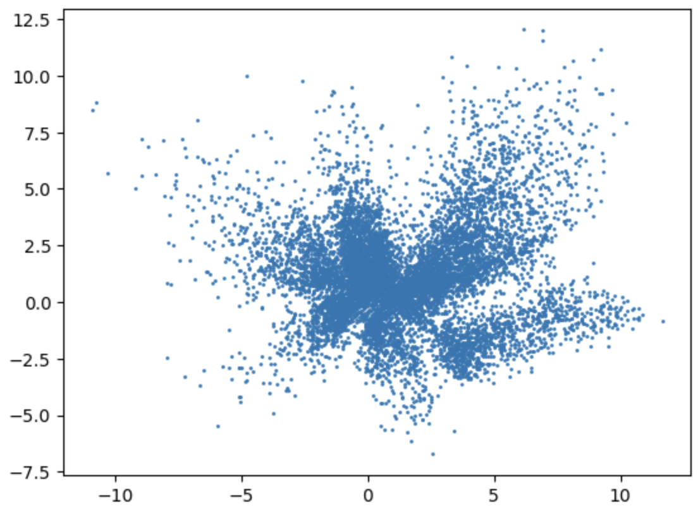
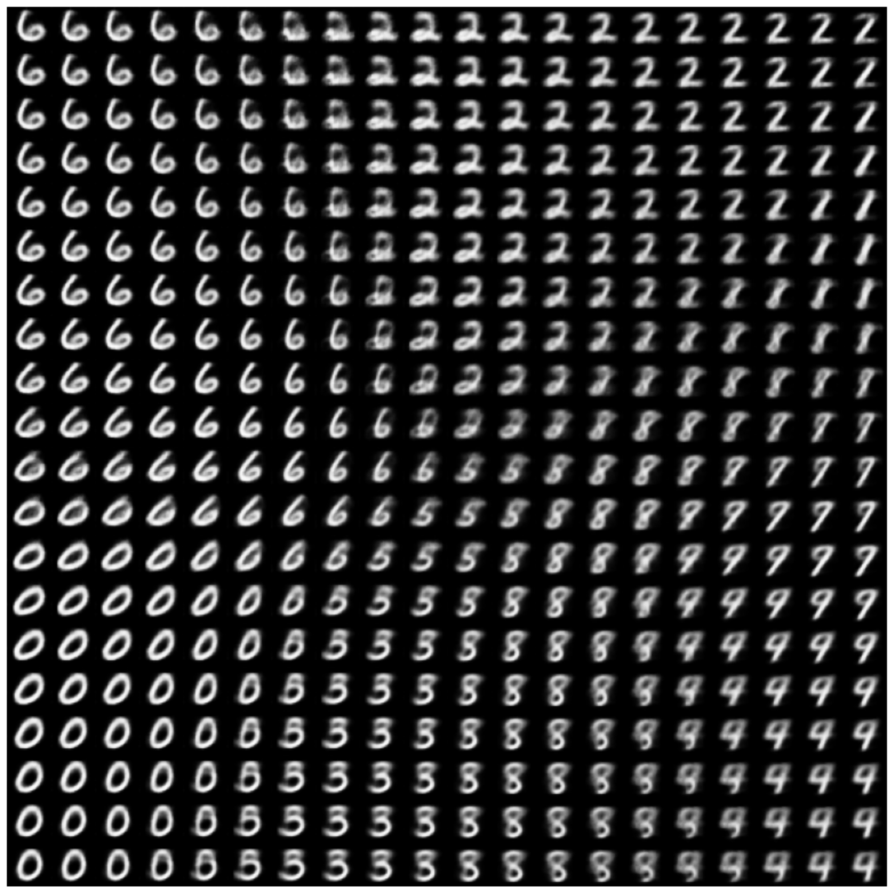
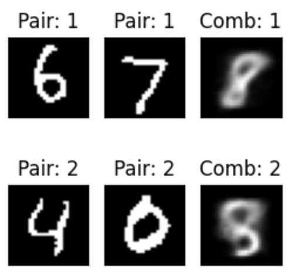
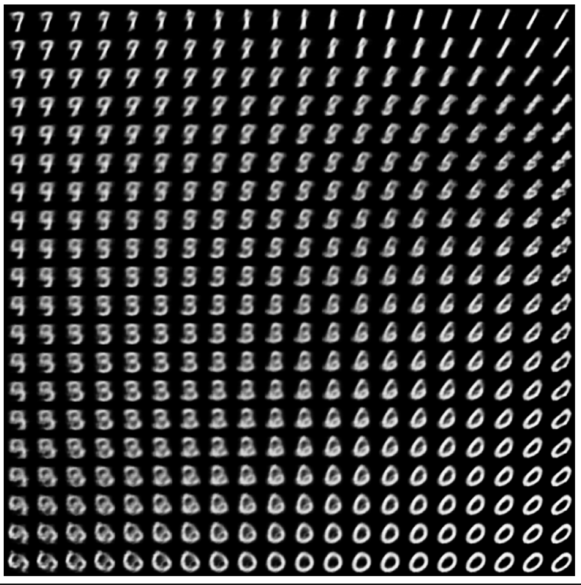
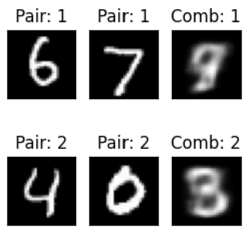

Marcin Wardyński  
wtorek, 9:45

## 1. AutoEnkoder (AE)

#### Zadanie 1.1 - Dlaczego sigmoid jest odpowiednią funkcją aktywacji w ostatniej warstwie dekodera w tym przypadku? (0.25pkt)

Ponieważ chcemy generować przypadki wyjściowe w sposób podobny do danych wejściowych. Na wejściu autoenkodera podawaliśmy obrazki w skali szarości, gdzie intensywność bieli wyrażona jest w sposób znormalizowany w przedziale [0, 1], chcąc otrzymać taki sam przedział wartości na wyjściu aplikujemy sigmoidę jako funkcję aktywacji ostatniej warstwy, która sprowadza generowane wartości do pożądanego przedziału [0, 1].


#### Zadanie 1.2. Skompiluj model. W tym celu najpierw zdefiniuj loss dla modelu. W przypadku autoenkodera jest to funkcja działająca na wejściach do enkodera oraz wyjściach z dekodera. Do wyboru są różne funkcje! Patrząc na reprezentację danych (wróć do funkcji definiującej preprocessing), wybierz odpowiednią. Uzasadnij swój wybór. (0.25 pkt)

```python
autoencoder.compile(optimizer='adam', loss=keras.losses.MeanSquaredError)
```

Wartości wejściowymi są wartościami ciągłymi na przedziale [0, 1], a poprzez zastosowanie sigmoidy jako funkcji aktywacji w ostatniej warstwie również wartości wyjściowe przyjmą taki sam przedział. Ponieważ nie klasyfykujemy danych do dwóch osobnych grup, 0 lub 1, lecz obliczamy funkcję kosztu dla dwóch wartości z przedziału ciągłego, dobrze nada się do tego podejście typu MSE, lub jemu podobne np.: RMSE lub MAE.

#### Zadanie 1.3. Wybierz ze zbioru testowego dwa obrazy z różnymi liczbami. Dobierz takie liczby, dla których spodziewasz się, że odkodowanie średniej z ich zenkodowanych reprezentacji będzie miało sens. Wybierz dwie takie pary.

Przygotowanie:

```python
def plot_latent_space(model, data):
  coords = model.encoder(data).numpy()
  plt.scatter(coords[:, 0], coords[:, 1], s=1)
  plt.show()
```



```
def plot_latent_images(model, n, digit_size=28):

  grid_x = np.linspace(-2, 2, n)
  grid_y = np.linspace(-2.5, 2.5, n)

  ...
```

Do wygenerowania tablicy liczb wybrałem obszar o największej gęstości występowania zakodowanych elementów, tj. x i y pomiędzy -2.5 i 2.5.



Wybrałem pary: 6 i 7 oraz 4 i 0

```python
def combine_pairs(model, pairs):
    plt.figure(figsize=(3, 3))
    N = 3
    for i, pair in enumerate(pairs):
        enc_pair = []
        for j, num in enumerate(pair):
            ax = plt.subplot(2, N, j + 1 + i*N)
            plt.imshow(num)
            plt.title(f"Pair: {i+1}")
            plt.gray()
            ax.get_xaxis().set_visible(False)
            ax.get_yaxis().set_visible(False)
            
            enc_num = model.encoder(np.array([num])).numpy()
            enc_pair.append(enc_num)
        mean_enc_pair = np.mean(np.array(enc_pair), axis=0)
        comb_pair = model.decoder(mean_enc_pair).numpy()
        ax = plt.subplot(2, N, 3 + i*N)
        plt.imshow(comb_pair[0])
        plt.title(f"Comb: {i+1}")
        plt.gray()
        ax.get_xaxis().set_visible(False)
        ax.get_yaxis().set_visible(False)

pair_6_7 = [x_test[21], x_test[0]]
pair_4_0 = [x_test[4], x_test[3]]
pairs = [pair_6_7, pair_4_0]

combine_pairs(autoencoder, pairs)
```

Dla których powyższy kod produkuje następujący wynik:



Pierwsza para wypadła całkiem nieźle, gdyż faktycznie uśrednienie liczb 6 i 7 wskazywało na powstanie czegoś na kształt 5 lub 8. Wygenerowany kształt bardzo przypomina 8, choć dość rozmazane.

Druga para, 4 i 0, wygenerowała coś, co jest bardzo podobne do 3 albo 9. W tym wypadku oczekiwałem 5 lub 3, czyli właściwie udało się trafić, o ile bardzo obniżymy swoje oczekiwania co do czytelności wygenerowanego znaku.

Jak widać nie zawsze udaje się wygenerować jednoznaczne liczby, natomiast obydwa rezultaty mają część wspólną: są mocno rozmazane.

## 2. AutoEnkoder wariacyjny (VAE)

#### Zadanie 2.1. Dlaczego powyższa implementacje CVAE nie stosuje żadnej aktywacji w ostatniej warstwie enkodera? Czy jakaś funkcja by się tutaj nadawała? (0.25pkt)

Warstwa latentna zwaraca parametry rozkładu Gaussa, takie jak średnia i odchylenie standardowe, czy też jak w naszym przypadku logarytm z wariancji. Obydwie te wartości należą do zbioru liczb rzeczywistych i dla zapewnienia lepszych efektów uczenia się enkodera, wartości te powinny pozostać bez zmian na wyjściu z niego.

Przyjrzyjmy się kilku funkcjom aktywacji:
- ReLU - zeruje wartości ujemne
- Sigmoida - ma dużą zmienność dla dziedziny w okolicach 0, a w pozostałych przedziałach dziedziny zmienia się znacznie wolniej
- tanh - podobnie do sigmoidy

Zastosowanie funkcji aktywacji zaburzyłoby tylko wartości rozkładu, którego specyfiki próbuje się nauczyć enkoder, uwaga ta tyczy się wszystkich funkcji nieliniowych. Funkcje liniowe natomiast tylko przeniosą przedział wartości wyjściowych, więc ma z nich w tym przypadku żadnego porzytku.

Na podstawie powyższej argumentacji stwierdzam, że w tym przypadku do poprawy jakości modelu nie nada się żadna funkcja aktywacji.

#### Zadanie 2.2. Skomentuj wynik uzyskany przy użyciu funkcji plot_latent_images. Zwróć uwagę na jakość/sensowność rysowanych liczb. Porównaj wykres do analogicznego wykresu dla modelu AE. Zamieść w raporcie wykresy. (0.25pkt)

Najpierw powtórzę tablicę liczb dla AE:


A poniżej wkleję tablicę liczb dla VAE:



Czego należało się spodziewać, rozmieszczenie liczb w tablicy jest różne, co wiąże się z różnicami, jakie przyjmują zmienne latentne dla obydwu modeli.

W obydwu przypadkach udało się zaprezentować większość występujących cyfr i chociaż obszar dla VAE w przestrzeni kartezjańskiej jest znacznie mniejszy, ilość uwzględnionych punktów z wybranego zakresu jest dość podobna.

Jakościowo wyniki nie odbiegają znacząco jedne od drugich. Zarówno wśród wyników AE, jak i VAE jasno widać przenikanie się pomiędzy cyframi i użytych modeli, których trening trwał 10 epok, nie jestem w stanie wskazać faworyta.


#### Zadanie 2.3. Porównaj wyniki funkcji _plot_latent_space_ dla AE oraz VAE. Zwróć uwagę na "gęstość" punktów oraz zakres wartości. Zamieść w raporcie wykresy.

Z poprzedniej sekcji uzyskaliśmy następujący rozkład zmiennych latentnych w AE:


Rozmieszczenie zmiennych latentnych w przestrzeni kartezjańskiej odpowiadających za rozkład prawdopodobieństw użytych sampli w VAE:


Funkcja użyta do generacji powyższego wykresu dla VAE:

```python
def plot_latent_space(model, data):
  mean, logvar = model.encode(data)
  std = tf.exp(logvar / 2)
  
  plt.figure(figsize=(10, 10))
  plt.errorbar(mean[:, 0], mean[:, 1], xerr=std[:, 0], yerr=std[:, 1], ecolor='red', fmt='o', markersize=1, )
  plt.show()
```

Jak już pokrótce zauważyłem w poprzednim zadaniu, punkty w wykresie dla VAE są gęściej upakowane, a ich przedział wartości jest mniejszy, niż dla AE.

Uwzględniają odchylenia standardowe, wciąż widać znaczne przecięcia pomiędzy sąsiadującymi punktami, które mogą reprezentować różne liczby, czego efektem jest przenikanie się reprezentacji cyfr tworzonych przez enkoder - patrz wyniki z zadania 2.2.

Ciekawym elementem wykresu dla VAE jest grupa w prawej-dolnej części wykresu, która się znacznie odłączyła od reszty. Porównując wykres z tablicą liczb dla VAE można uznać, że jest grupa generująca zera.

#### Zadanie 2.4. Dla tych samych par obrazów, na których pracowałaś/eś w ostatnim zadaniu dot. AE, przygotuj reprezentacje ukryte z pomocą wytrenowanego VAE i odkoduj średnie z reprezentacji. Skomentuj wyniki, porównaj z wynikami z AE.

Funkcja generująca reprezentacje dla uśrednionych sampli:

```python
def combine_pairs(model, pairs):
    plt.figure(figsize=(3, 3))
    N = 3
    for i, pair in enumerate(pairs):
        enc_pair = []
        for j, num in enumerate(pair):
            ax = plt.subplot(2, N, j + 1 + i*N)
            plt.imshow(num)
            plt.title(f"Pair: {i+1}")
            plt.gray()
            ax.get_xaxis().set_visible(False)
            ax.get_yaxis().set_visible(False)
            
            mean, logvar = model.encode(np.array([num]))
            z = model.reparameterize(mean, logvar).numpy()
            enc_pair.append(z)
        mean_enc_pair = np.mean(np.array(enc_pair), axis=0)
        comb_pair = model.sample(mean_enc_pair)
        ax = plt.subplot(2, N, 3 + i*N)
        plt.imshow(comb_pair[0])
        plt.title(f"Comb: {i+1}")
        plt.gray()
        ax.get_xaxis().set_visible(False)
        ax.get_yaxis().set_visible(False)

pair_6_7 = [x_test[21], x_test[0]]
pair_4_0 = [x_test[4], x_test[3]]
pairs = [pair_6_7, pair_4_0]

combine_pairs(model, pairs)
```

wygenerowała następujący wynik:



Dla pary 6 i 7 spodziwałam się zobaczyć 5 albo 9 i faktycznie uzyskana cyfra jest dziewiątką.

Druga para liczb, mianowicie 4 i 0, wygenerowały liczbę 3. Porównanie wyniku z tablicą liczb VAE jest trudniejsze, gdyż o ile 0 jest łatwe do odnalezienia, 4 właściwie nie występuje w tablicy. Natomiast wiedząc, że para 4 i 0 generuje 3, a 3 jest na lewo od 0, to 4 musi znajdować się całkiem po lewej stronie, ale zostało wycięte przy doborze obszaru do stworzenia tablicy liczb. Faktycznie kształty po lewej stronie tablicy mogą przypominać 4.

Wygenerowane liczby nie są zupełnie czytelne, ale wg mnie są czytelniejsze, od tych wygenerowanych przez AE.  
Oczywiście, skoro rozlokowanie liczb w przestrzeni 2D jest odmienne dla AE i VAE, wygenerowane liczby z uśrednienia tych samych liczb wejściowych powinny być różne dla każdego z modeli i tak też jest.

#### Zadanie 2.5. Wróć do funkcji _compute_loss_ ... wykorzystaj wzór na KL-divergence dla dwóch rozkładów gaussowskich. Zamieść w raporcie przygotowaną formułę. Wytrenuj model ponownie, porównaj wyniki z poprzednią implementacją _compute_loss_.

Formuła KL-divergence dla dwóch rozkładów gaussowskich wygląda następująco:

$$ \mathcal{D} [\mathcal{N}(\mu(X), \Sigma(X)) || \mathcal{N}(0, I)] = 
\frac{1}{2} (tr(\Sigma(X)) + (\mu(X))^T (\mu(X)) - k - log det (\Sigma(X)))$$

którą można zapisać w postaci funkcji python w następujący sposób:

```python
def kl_div(mean, logvar):
  var = tf.exp(logvar)
  trace_var = tf.reduce_sum(var, axis=1)
  mean_squared_norm = tf.reduce_sum(tf.square(mean), axis=1)
  log_det_sigma = tf.reduce_sum(logvar, axis=1)
  k = tf.cast(tf.shape(mean)[1], tf.float32)

  return  0.5 * (trace_var + mean_squared_norm - k - log_det_sigma)
```
Objaśnienie co do wartości ze wzoru:
- na podstawie logarytmu wariancji wyciągamy wariancję
- ślad macierzy $\Sigma$ to suma wartości wekora wariancji
- średnia to wektor dwuliczbowy, z którego obliczamy kwadrat normy euklidesowej
- dla stabilności obliczen w ostatnim elemencie, zamiast obliczać logarytm pomnożonych wartości wektora wariancji, dodaję do siebie wartości `logvar`, co sprowadza się do tego samego wyniku
- $k$ to liczba długość wektorów wejściowych, czyli 2

Dodatkowo, funkcja została zapisana w taki sposób, aby operowała na minibatchach.

Funkcja `compute_loss_gauss_kl` wykorzystująca `kl_div` przyjmuje następującą postać:

```python
  mean, logvar = model.encode(x)
  z = model.reparameterize(mean, logvar)
  x_logit = model.decode(z)
  cross_ent = tf.nn.sigmoid_cross_entropy_with_logits(logits=x_logit, labels=x)
  logpx_z = -tf.reduce_sum(cross_ent, axis=[1, 2, 3])

  kl_div_val = kl_div(mean, logvar)
  
  return  -tf.reduce_mean(logpx_z - kl_div_val)
```

Wyniki uzyskane przy użyciu `compute_loss_gauss_kl` nie różnią się niczym od tych uzyskanych stosując bazową funkcję straty `compute_loss`, a wartość `ELBO` dla obydwu podejść po ukończeniu treningu jest prawie taka sama i wynosi ok 158.