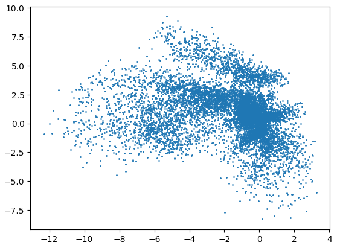
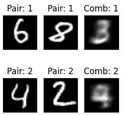

Marcin Wardyński  
wtorek, 9:45

## 1. AutoEnkoder (AE)

#### Zadanie 1.1 - Dlaczego sigmoid jest odpowiednią funkcją aktywacji w ostatniej warstwie dekodera w tym przypadku? (0.25pkt)

Ponieważ chcemy generować przypadki wyjściowe w sposób podobny do danych wejściowych. Na wejściu autoenkodera podawaliśmy obrazki w skali szarości, gdzie intensywność bieli wyrażona jest w sposób znormalizowany w przedziale [0, 1], chcąc otrzymać taki sam przedział wartości na wyjściu aplikujemy sigmoidę jako funkcję aktywacji ostatniej warstwy, która sprowadza generowane wartości do pożądanego przedziału [0, 1].


#### Zadanie 1.2. Skompiluj model. W tym celu najpierw zdefiniuj loss dla modelu. W przypadku autoenkodera jest to funkcja działająca na wejściach do enkodera oraz wyjściach z dekodera. Do wyboru są różne funkcje! Patrząc na reprezentację danych (wróć do funkcji definiującej preprocessing), wybierz odpowiednią. Uzasadnij swój wybór. (0.25 pkt)

```python
autoencoder.compile(optimizer='adam', loss=keras.losses.BinaryCrossentropy)
```

Najlepszą funkcją straty dla rozważanego autoenkodera wydaje mi się być BCE = binarna entropia krzyżowa, a to gdyż świetnie zgadza się z danymi wejściowymi i wyjściowymi modelu, które zawierają się w przedziale [0, 1]. Takimi wartościami określa się prawdopodobieństwa, a entropia krzyżowa bazuje na "Likelihood", które to opiera się na prawdopodobieństwie.

Intuicyjnie: wartości [0, 1] określają prawdopodobieństwo zapalenia się danego piksela, jeśli wartości skorelowanych pikseli na wejściu i wyjściu są określone rozbieżnym prawdopodobieństwem, to najpeniej w jednym przypadku się zapalą, a w drugim nie, przez co wygenerowany obraz nie będzie odpowiadal temu wejściowemu. BCE ukarze model za takie rozbieżności.

#### Zadanie 1.3. Wybierz ze zbioru testowego dwa obrazy z różnymi liczbami. Dobierz takie liczby, dla których spodziewasz się, że odkodowanie średniej z ich zenkodowanych reprezentacji będzie miało sens. Wybierz dwie takie pary.

Przygotowanie:

```python
def plot_latent_space(model, data):
  coords = model.encoder(data).numpy()
  plt.scatter(coords[:, 0], coords[:, 1], s=1)
  plt.show()
```



```
def plot_latent_images(model, n, digit_size=28):

  grid_x = np.linspace(-2, 2, n)
  grid_y = np.linspace(-2.5, 2.5, n)

  ...
```

Do wygenerowania tablicy liczb wybrałem obszar o największej gęstości występowania zakodowanych elementów, tj. x pomiędzy -2 i 2, a y między -2.5 i 2.5.


Wybrałem pary: 6 i 8 oraz 4 i 2

```python
pair_6_8 = [x_test[21], x_test[61]]
pair_4_2 = [x_test[4], x_test[1]]
pairs = [pair_6_8, pair_4_2]

plt.figure(figsize=(3, 3))
N = 3
for i, pair in enumerate(pairs):
    enc_pair = []
    for j, num in enumerate(pair):
        ax = plt.subplot(2, N, j + 1 + i*N)
        plt.imshow(num)
        plt.title(f"Pair: {i+1}")
        plt.gray()
        ax.get_xaxis().set_visible(False)
        ax.get_yaxis().set_visible(False)
        
        enc_num = autoencoder.encoder(np.array([num])).numpy()
        enc_pair.append(enc_num)
    mean_enc_pair = np.mean(np.array(enc_pair), axis=0)
    comb_pair = autoencoder.decoder(mean_enc_pair).numpy()
    ax = plt.subplot(2, N, 3 + i*N)
    plt.imshow(comb_pair[0])
    plt.title(f"Comb: {i+1}")
    plt.gray()
    ax.get_xaxis().set_visible(False)
    ax.get_yaxis().set_visible(False)
```

Dla których powyższy kod produkuje następujący wynik:



Pierwsza para wypadła całkiem nieźle, gdyż faktycznie uśrednienie liczb 6 i 8 wskazywało na powstanie czegoś na kształt 5 lub 3. Wygenerowany kształt bardzo przypomina 3, choć dość rozmazane.

Druga para, 4 i 2, wygenerowała tylko rozmazane 4, a więc jedną z wybranych liczb, a oczekiwałem 8 lub 3. Tym razem się nie udało wygenerować nowej liczby, najwyraźniej uśrednienie wybranych 4 i 2 znajdowało się wciąż w obszarze dominacji 4.

Jak widać nie zawsze udaje się wygenerować nowe liczby, natomiast obydwa rezultaty mają część wspólną: są mocno rozmazane.