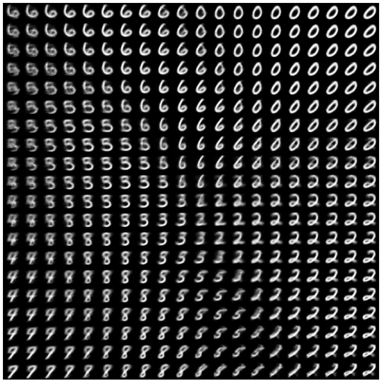

Marcin Wardyński  
wtorek, 9:45

### Uwaga do sprawozdania:
W notatniku dodałem `seed=42` do funkcji `shuffle` przy wybieraniu zbioru treningowego, walidacyjnego i testowego dla każdego z modeli, żeby zachować powtarzalność wyników. Jendakże wyniki do zadania 1 i 2 zostały zebrane jeszcze wcześniej, stąd wykresy w sprawozdaniu różnią się od obecnych wykresów w notatniku.

## 1. AutoEnkoder (AE)

#### Zadanie 1.1 - Dlaczego sigmoid jest odpowiednią funkcją aktywacji w ostatniej warstwie dekodera w tym przypadku? (0.25pkt)

Ponieważ chcemy generować przypadki wyjściowe w sposób podobny do danych wejściowych. Na wejściu autoenkodera podawaliśmy obrazki w skali szarości, gdzie intensywność bieli wyrażona jest w sposób znormalizowany w przedziale [0, 1], chcąc otrzymać taki sam przedział wartości na wyjściu aplikujemy sigmoidę jako funkcję aktywacji ostatniej warstwy, która sprowadza generowane wartości do pożądanego przedziału [0, 1].


#### Zadanie 1.2. Skompiluj model. W tym celu najpierw zdefiniuj loss dla modelu. W przypadku autoenkodera jest to funkcja działająca na wejściach do enkodera oraz wyjściach z dekodera. Do wyboru są różne funkcje! Patrząc na reprezentację danych (wróć do funkcji definiującej preprocessing), wybierz odpowiednią. Uzasadnij swój wybór. (0.25 pkt)

```python
autoencoder.compile(optimizer='adam', loss=keras.losses.MeanSquaredError)
```

Wartości wejściowymi są wartościami ciągłymi na przedziale [0, 1], a poprzez zastosowanie sigmoidy jako funkcji aktywacji w ostatniej warstwie również wartości wyjściowe przyjmą taki sam przedział. Ponieważ nie klasyfykujemy danych do dwóch osobnych grup, 0 lub 1, lecz obliczamy funkcję kosztu dla dwóch wartości z przedziału ciągłego, dobrze nada się do tego podejście typu MSE, lub jemu podobne np.: RMSE lub MAE.

#### Zadanie 1.3. Wybierz ze zbioru testowego dwa obrazy z różnymi liczbami. Dobierz takie liczby, dla których spodziewasz się, że odkodowanie średniej z ich zenkodowanych reprezentacji będzie miało sens. Wybierz dwie takie pary.

Przygotowanie:

```python
def plot_latent_space(model, data):
  coords = model.encoder(data).numpy()
  plt.scatter(coords[:, 0], coords[:, 1], s=1)
  plt.show()
```


```
def plot_latent_images(model, n, digit_size=28):

  grid_x = np.linspace(-2, 2, n)
  grid_y = np.linspace(-2.5, 2.5, n)

  ...
```

Do wygenerowania tablicy liczb wybrałem obszar o największej gęstości występowania zakodowanych elementów, tj. x i y pomiędzy -2.5 i 2.5.



Wybrałem pary: 6 i 8 oraz 4 i 2

```python
pair_6_8 = [x_test[21], x_test[61]]
pair_4_2 = [x_test[4], x_test[1]]
pairs = [pair_6_8, pair_4_2]

plt.figure(figsize=(3, 3))
N = 3
for i, pair in enumerate(pairs):
    enc_pair = []
    for j, num in enumerate(pair):
        ax = plt.subplot(2, N, j + 1 + i*N)
        plt.imshow(num)
        plt.title(f"Pair: {i+1}")
        plt.gray()
        ax.get_xaxis().set_visible(False)
        ax.get_yaxis().set_visible(False)
        
        enc_num = autoencoder.encoder(np.array([num])).numpy()
        enc_pair.append(enc_num)
    mean_enc_pair = np.mean(np.array(enc_pair), axis=0)
    comb_pair = autoencoder.decoder(mean_enc_pair).numpy()
    ax = plt.subplot(2, N, 3 + i*N)
    plt.imshow(comb_pair[0])
    plt.title(f"Comb: {i+1}")
    plt.gray()
    ax.get_xaxis().set_visible(False)
    ax.get_yaxis().set_visible(False)
```

Dla których powyższy kod produkuje następujący wynik:


Pierwsza para wypadła całkiem nieźle, gdyż faktycznie uśrednienie liczb 6 i 8 wskazywało na powstanie czegoś na kształt 5 lub 3. Wygenerowany kształt bardzo przypomina 3, choć dość rozmazane.

Druga para, 4 i 2, wygenerowała coś, co jest bardzo podobne do 3 albo 9. W tym wypadku również oczekiwałem 5 lub 3, czyli właściwie udało się trafić, o ile bardzo obniżymy swoje oczekiwania co do czytelności wygenerowanego znaku.

Jak widać nie zawsze udaje się wygenerować jednoznaczne liczby, natomiast obydwa rezultaty mają część wspólną: są mocno rozmazane.

## 2. AutoEnkoder wariacyjny (VAE)

#### Zadanie 2.1. Dlaczego powyższa implementacje CVAE nie stosuje żadnej aktywacji w ostatniej warstwie enkodera? Czy jakaś funkcja by się tutaj nadawała? (0.25pkt)

Warstwa latentna zwaraca parametry rozkładu Gaussa, takie jak średnia i odchylenie standardowe, czy też jak w naszym przypadku logarytm z wariancji. Obydwie te wartości należą do zbioru liczb rzeczywistych i dla zapewnienia lepszych efektów uczenia się enkodera, wartości te powinny pozostać bez zmian na wyjściu z niego.

Przyjrzyjmy się kilku funkcjom aktywacji:
- ReLU - zeruje wartości ujemne
- Sigmoida - ma dużą zmienność dla dziedziny w okolicach 0, a w pozostałych przedziałach dziedziny zmienia się znacznie wolniej
- tanh - podobnie do sigmoidy

Zastosowanie funkcji aktywacji zaburzyłoby tylko wartości rozkładu, którego specyfiki próbuje się nauczyć enkoder, uwaga ta tyczy się wszystkich funkcji nieliniowych. Funkcje liniowe natomiast tylko przeniosą przedział wartości wyjściowych, więc ma z nich w tym przypadku żadnego porzytku.

Na podstawie powyższej argumentacji stwierdzam, że w tym przypadku do poprawy jakości modelu nie nada się żadna funkcja aktywacji.

#### Zadanie 2.2. Skomentuj wynik uzyskany przy użyciu funkcji plot_latent_images. Zwróć uwagę na jakość/sensowność rysowanych liczb. Porównaj wykres do analogicznego wykresu dla modelu AE. Zamieść w raporcie wykresy. (0.25pkt)

```python
def plot_latent_space(model, data):
  mean, logvar = model.encode(data)
  std = tf.exp(logvar / 2)
  
  plt.figure(figsize=(10, 10))
  plt.errorbar(mean[:, 0], mean[:, 1], xerr=std[:, 0], yerr=std[:, 1], ecolor='red', fmt='o', markersize=1, )
  plt.show()
```

